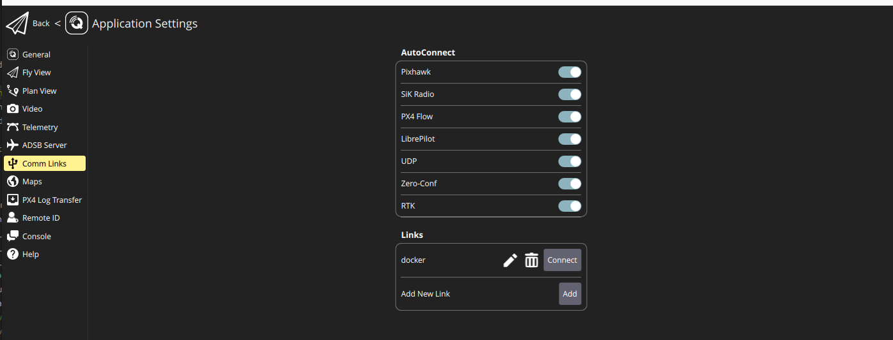
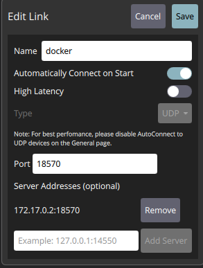

# Quick Start Guide: Launching a Simulation with ROS2_UAV Framework

## Prerequisites

- Install Docker and ensure it is running on your system. You will need the `nvidia-container-runtime` since the simulation requires NVIDIA GPUs.
- Download the latest [QGroundControl](https://d176tv9ibo4jno.cloudfront.net/builds/master/QGroundControl.AppImage) to access the necessary modes.

## Steps

### 1. Launch the PX4 SITL Simulation

Go to the `tools/docker_scripts` folder and start the simulation using the provided custom configuration file:

```bash
cd tools/docker_scripts
./launch_simulation.sh -f ../configurations/simulation_config_custom.yaml -b main -a
```

This command opens a Gazebo window featuring drone models, with the `px4_sitl` container running in the background.

### 2. Launch the Control Nodes

Return to the `tools/docker_scripts` folder and initiate the control nodes using the same configuration file:

```bash
cd tools/docker_scripts
./launch_simulation_nodes.sh -f ../configurations/simulation_config_custom.yaml
```

This action starts the `ros2_uav_px4` container, controlling the drones in the background.

### 3. Retrieve Docker IP Address

Get the IP address of your Docker container running the PX4 SITL:

```bash
docker inspect -f '{{range.NetworkSettings.Networks}}{{.IPAddress}}{{end}}' px4_sitl
```

### 4. Configure Communication Links in QGroundControl

#### Adding a New Link

1. Open QGroundControl.
2. Proceed to **Application Settings**.

   

3. Click **Comm Links** in the sidebar.
4. Hit **Add**.

   

5. Select `UDP` as the Type.
6. Specify the **Port** as `18570 + drone_number`. For instance, for drone number 1 (namespace /uav1), set it to `18571`.
7. Input the Docker IP you noted earlier into **Server Addresses**.
8. Press **Add Server**.
9. Click **Save**.

#### Connect the Link

After setup, choose the newly added link and click **Connect** to link up with the drone.

### 5. Selecting the Mode

From the main screen of QGroundControl, pick a mode for your drone, such as `Offboard Position`. The drone will ascend and hover at a designated altitude, with position control managed by the `ros2_uav_px4` container's control node.

### 6. Sending a Setpoint

```bash
cd tools/docker_scripts
./send_setpoint.sh uav0 0 0 2 0
```

Here, `uav0` is the drone's namespace, `0 0 2` represents the x, y, z coordinates, and `0` is the heading.

<!-- TODO: Use docker-compose to simplify the process -->
<!-- TODO: See if we can take advantage of docker compose DNS to avoid getting the container IP -->
